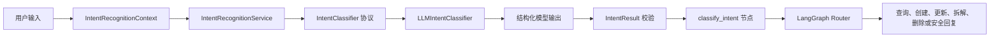

# 可插拔意图识别模块：代码快速入门

本文帮助你从代码层面快速理解 WekToDo-ai 当前的意图识别实现。读完后，你应该能够：

- 找到一次用户请求经过的核心代码；
- 理解 `IntentResult` 为什么是整个模块的契约；
- 使用 Fake 编写不调用真实模型的测试；
- 调整 Prompt、模型配置和 Graph 路由；
- 在不修改 Graph、API、任务服务和仓储的情况下扩展 Provider。

> 当前生产实现是 `LLMIntentClassifier`，默认模型是 `qwen-flash`。`FakeIntentClassifier` 只用于测试注入。Rule、Semantic、Hybrid 目前只有配置枚举，尚未实现。

## 1. 先建立整体认识

这个模块不是“执行任务的 Agent”，而是用户输入进入任务业务流程前的分类器。它只回答四个问题：

1. 用户想做哪种操作？
2. 用户提到了哪个任务？
3. 如果是状态更新，目标状态是什么？
4. 当前信息是否足够，是否需要澄清？

完整调用链如下：



最重要的边界是：**意图识别只分类，不执行操作。**

它不会查询 Redis、定位真实任务、创建 `PendingAction`、写审计日志或直接修改任务。即使识别结果是写操作，后面仍要经过任务匹配、归属校验、状态流转校验、用户确认、幂等校验和实际执行。

## 2. 建议阅读顺序

第一次阅读代码时，按下面顺序最容易建立上下文：

1. `agent-service/app/intent/enums.py`：系统支持哪些意图；
2. `agent-service/app/intent/models.py`：输入、输出及业务校验；
3. `agent-service/app/intent/contracts/classifier.py`：Provider 必须实现的接口；
4. `agent-service/app/intent/service.py`：统一安全入口和降级策略；
5. `agent-service/app/intent/providers/llm.py`：真实模型 Provider；
6. `agent-service/app/intent/prompts.py`：模型分类规则；
7. `agent-service/app/intent/factory.py`：Provider 如何按配置创建；
8. `agent-service/app/graph/nodes/classify_intent.py`：结果如何写入 Graph State；
9. `agent-service/app/graph/routing.py`：每种意图进入哪个节点；
10. `agent-service/app/graph/builder.py`：Service 如何注入 Graph。

## 3. 目录职责

```text
agent-service/app/intent/
├── enums.py                  # 意图和 Provider 枚举
├── models.py                 # Context 与 IntentResult
├── exceptions.py             # 模块内部异常
├── prompts.py                # System Prompt 和消息构造
├── service.py                # 统一入口、空输入和安全降级
├── factory.py                # 唯一允许按 Provider 分支的位置
├── contracts/
│   └── classifier.py         # IntentClassifier 协议
└── providers/
    ├── llm.py                # 真实结构化模型实现
    └── fake.py               # 测试实现
```

与 Graph 集成相关的文件：

```text
agent-service/app/graph/
├── state.py                  # 保存 intent_result 等状态
├── routing.py                # 纯路由判断
├── builder.py                # 注入 IntentRecognitionService
└── nodes/
    ├── classify_intent.py    # 调用 Service
    └── respond_to_intent.py  # 澄清、闲聊、未开放和 UNKNOWN 回复
```

`agent-service/app/graph/classifier.py` 只是迁移后的兼容导出，不再包含主分类逻辑。新代码应直接使用 `app.intent` 下的接口和模型。

## 4. 两个核心数据模型

### 4.1 IntentRecognitionContext

Provider 只能从 Context 获取分类信息：

```python
class IntentRecognitionContext(BaseModel):
    message: str
    conversation_id: str | None = None
    user_id: str | None = None
    recent_messages: list[str] = Field(default_factory=list)
    metadata: dict[str, object] = Field(default_factory=dict)
```

当前 Graph 节点会传入：

- `message`：本次用户消息；
- `conversation_id`：当前 `thread_id`；
- `user_id`：当前用户 ID。

`recent_messages` 和 `metadata` 仍未注入 LLM。v0.2.3 按实际开发顺序统一收录三层跨轮能力：首先由结构化 `ActiveTaskContext` 保存同一用户和线程的短期焦点任务 ID；其次将候选草稿、有限输入、缺失字段和 TTL 写入 `PendingTaskDraftClarification`；最后使用共享待补充外层，在 `PendingTaskUpdateClarification` 中保存目标 ID、期望版本和最小修改结果。任务事实仍在每次恢复时从 Redis 重读。这些能力都不等于完整聊天历史、复数指代、跨线程记忆或长期语义记忆。

### 4.2 IntentResult

`IntentResult` 是 Provider、Service 和 Graph 之间的统一契约：

```python
class IntentResult(BaseModel):
    intent: IntentType
    confidence: float
    reason: str
    task_reference: str | None = None
    target_status: TaskStatus | None = None
    needs_clarification: bool = False
    clarification_question: str | None = None
```

字段含义：

| 字段 | 用途 |
|---|---|
| `intent` | 决定 Graph 的下一条分支 |
| `confidence` | 模型自评分，仅用于观察，不作为写操作授权 |
| `reason` | 一句简短分类依据 |
| `task_reference` | 用户消息中的任务名称或引用，不代表任务真实存在 |
| `target_status` | 状态更新的目标值，复用领域层 `TaskStatus` |
| `needs_clarification` | 是否必须先询问用户 |
| `clarification_question` | 返回给用户的澄清问题 |

模型还会强制执行以下约束：

- 禁止额外字段；
- `confidence` 必须在 0 到 1 之间；
- `reason` 必须为 1～200 个字符；
- 需要澄清时必须提供问题；
- 不需要澄清时不得携带澄清问题；
- 只有 `UPDATE_TASK_STATUS` 可以携带 `target_status`；
- 明确的状态更新必须提供 `target_status`。

## 5. 当前支持的意图

| IntentType | 当前 Graph 行为 |
|---|---|
| `CREATE_TASK` | 进入现有任务解析、校验、优先级计算和确认创建流程 |
| `QUERY_TASKS` | 查询 Redis 中的真实任务数据 |
| `UPDATE_TASK` | 定位任务，解析属性补丁，确认后更新 |
| `UPDATE_TASK_STATUS` | 定位任务，校验状态流转，确认后更新 |
| `DECOMPOSE_TASK` | 定位父任务，生成并校验拆解方案，确认后原子批量创建子任务 |
| `DELETE_TASK` | 进入独立删除解析器，将自然语言转换为受控查询参数；Redis 查询并预览全部匹配项后，确认执行带版本、幂等和父任务联动的原子删除 |
| `GENERAL_CHAT` | 返回普通中文能力提示 |
| `UNKNOWN` | 返回无法识别提示或服务不可用提示 |

路由永远先检查 `needs_clarification`，然后才检查 `intent`。因此“把它标记完成”虽然属于状态更新，但会先进入澄清节点，不会访问仓储或进入写流程。

## 6. 一次请求如何运行

### 第一步：应用启动时组装依赖

`app/main.py` 在生产启动阶段创建：

```text
Settings
  ├── create_task_parser(...)
  ├── create_intent_service(...)
  └── RedisTaskRepository
          ↓
    GraphDependencies
          ↓
    build_task_graph(...)
```

模型客户端、结构化 Runnable、Provider 和 Service 都在启动或 Graph 构建阶段创建，而不是每次节点执行时重新创建。

### 第二步：Factory 创建 Provider

`create_intent_service()` 会调用 `create_intent_classifier()`：

1. 读取 `intent_classifier_provider`；
2. 当前只接受 `llm`；
3. 通过公共 `create_chat_model()` 创建模型；
4. 调用 `with_structured_output(IntentResult, ...)`；
5. 构造 `LLMIntentClassifier`；
6. 构造 `IntentRecognitionService`。

`rule`、`semantic`、`hybrid` 是合法配置值，但尚未实现。选择它们时 Factory 会抛出 `UnsupportedIntentProviderError`，不会偷偷回退到 LLM。

### 第三步：Service 统一处理

`IntentRecognitionService.recognize()` 做三件事：

1. 空输入直接返回需要澄清的 `UNKNOWN`；
2. 调用注入的分类器；
3. 捕获意图模块异常或最终校验错误，安全降级。

服务不可用时的降级结果为：

```json
{
  "intent": "UNKNOWN",
  "confidence": 0,
  "reason": "意图识别服务暂时不可用",
  "needs_clarification": false,
  "clarification_question": null
}
```

这里故意不伪装成“用户表达不清”，Graph 会提示用户稍后重试。

### 第四步：LLM Provider 调用结构化模型

`LLMIntentClassifier` 接收的不是 API Key 或环境变量，而是已经构造好的结构化模型和 Prompt Builder。

它负责：

- 使用 Prompt Builder 生成消息；
- 异步调用结构化 Runnable；
- 再次执行 `IntentResult.model_validate()`；
- 将模型服务错误、超时转换成 `IntentProviderUnavailableError`；
- 将非法结构化结果转换成 `InvalidIntentOutputError`。

它不会捕获所有 `Exception`，因此真正的编程错误不会被静默吞掉。

### 第五步：Graph 写入 State 并路由

`classify_intent` 节点把同一个 `IntentResult` 同时写为：

- `intent_result`：完整结构化结果；
- `intent`：兼容和路由字段；
- `intent_confidence`；
- `task_reference`；
- `target_status`。

兼容字段全部从同一个结果派生，避免状态不一致。

## 7. Prompt 在哪里修改

所有意图 Prompt 都集中在 `agent-service/app/intent/prompts.py`。

其中包含：

- 模块职责；
- 禁止执行任务、调用工具或编造任务；
- Prompt 注入防护；
- 查询与写操作的边界样例；
- 澄清原则；
- `IntentResult` 的 JSON Schema。

用户消息被包在 `<user_message>` 标签内，并明确声明为“待分类数据”，不是系统指令。

如果要优化类似“论文实验做完了”的识别或任务引用提取，优先修改这里的规则和边界样例，然后同步增加评测数据，不要把关键词判断重新写进 Graph。

## 8. 配置项

根目录 `.env` 使用以下配置：

```env
LLM_API_KEY=你的密钥
LLM_BASE_URL=OpenAI兼容接口地址
LLM_STRUCTURED_OUTPUT_METHOD=json_mode

INTENT_CLASSIFIER_PROVIDER=llm
INTENT_MODEL_NAME=qwen-flash
INTENT_MODEL_TEMPERATURE=0
INTENT_MODEL_MAX_TOKENS=200
INTENT_MODEL_ENABLE_THINKING=false
```

说明：

- API Key、Base URL 和结构化输出方式与任务解析模型共用配置系统；
- 意图模型名称和生成参数单独配置；
- `enable_thinking` 通过 `extra_body` 传给 OpenAI 兼容接口；
- 修改配置后需要重启服务。

## 9. 使用 Fake 快速理解和测试

Fake 不读取 `.env`，也不调用真实模型。最小示例：

```python
from app.intent.enums import IntentType
from app.intent.models import IntentRecognitionContext, IntentResult
from app.intent.providers.fake import FakeIntentClassifier
from app.intent.service import IntentRecognitionService

classifier = FakeIntentClassifier(
    IntentResult(
        intent=IntentType.GENERAL_CHAT,
        confidence=1,
        reason='测试固定结果',
    )
)
service = IntentRecognitionService(classifier)

result = await service.recognize(
    IntentRecognitionContext(message='你好')
)
```

Fake 支持三种测试方式：

```python
# 1. 所有消息固定返回
FakeIntentClassifier(result=fixed_result)

# 2. 按消息返回
FakeIntentClassifier(
    responses={
        '你好': chat_result,
        '查任务': query_result,
    }
)

# 3. 主动抛错
FakeIntentClassifier(error=IntentProviderUnavailableError('offline'))
```

每次传入的 Context 都会记录在 `classifier.calls`，可以断言 Graph 是否正确传递了用户、线程和消息。

## 10. 测试与真实模型评测

只运行意图模块测试：

```powershell
conda activate langchain
python -m pytest agent-service/tests/intent -q
```

当前结果：

```text
45 passed
```

运行完整测试集时，如果本机 Redis 只能通过 IPv6 访问：

```powershell
$env:TEST_REDIS_URL='redis://[::1]:6379/15'
$env:TEST_CHECKPOINT_REDIS_URL='redis://[::1]:6379/0'
python -m pytest agent-service/tests -q
```

当前完整结果：

```text
128 passed
```

显式运行真实模型评测：

```powershell
python agent-service/scripts/check_intent_model.py
```

脚本读取 `evaluation/datasets/intent_cases.json`，不会访问 Redis 或修改任务。当前 `qwen-flash` 手工验证结果为 `12/12 PASS`，退出码为 `0`。

需要注意：评测脚本只检查数据集中声明的期望字段。某条数据如果只声明 `expected_intent`，即使 `task_reference` 提取不理想，也可能显示 PASS。扩充评测时应按关注点增加：

```json
{
  "text": "取消周报任务",
  "expected_intent": "UPDATE_TASK_STATUS",
  "expected_target_status": "CANCELLED",
  "expected_needs_clarification": false
}
```

## 11. 如何增加一个新 Provider

以未来的规则 Provider 为例，建议按以下步骤实现：

1. 在 `providers/rule.py` 创建 `RuleBasedIntentClassifier`；
2. 实现异步 `classify(context) -> IntentResult`；
3. 不读取 Graph State、FastAPI Request、Redis 或任务仓储；
4. 在 `factory.py` 中增加 `RULE` 构造分支；
5. 使用 Fake/Stub 编写 Provider、Service 和 Graph 测试；
6. 扩充 `evaluation/datasets/intent_cases.json`。

接口骨架：

```python
class RuleBasedIntentClassifier:
    async def classify(
        self,
        context: IntentRecognitionContext,
    ) -> IntentResult:
        ...
```

不需要修改：

- `graph/routing.py`；
- FastAPI 路由；
- `TaskAgentService`；
- Redis Repository；
- 创建和状态更新业务节点。

Provider 类型判断必须继续只存在于 Factory。

## 12. 常见修改应该去哪里

| 需求 | 修改位置 |
|---|---|
| 调整分类规则或边界样例 | `intent/prompts.py` |
| 新增意图类型 | `intent/enums.py`、`graph/routing.py` 及测试 |
| 修改输出约束 | `intent/models.py` |
| 修改异常降级 | `intent/service.py` |
| 适配新的模型异常 | `intent/providers/llm.py` |
| 切换模型或参数 | `.env` |
| 增加 Provider | `intent/providers/` 和 `intent/factory.py` |
| 增加真实模型案例 | `evaluation/datasets/intent_cases.json` |
| 修改意图后的 Graph 分支 | `graph/routing.py` 和 `graph/builder.py` |

## 13. 当前限制

目前没有实现：

- Rule、Semantic、Hybrid Provider；
- 多意图拆分；
- 基于 Embedding 或向量库的语义分类；
- 可靠的跨轮指代消解；
- 复杂任务参数提取；
- 自动样例学习和复杂置信度校准；
- 多层任务树、跨父任务依赖和已有执行计划覆盖。

小模型还可能出现两类现象：

- 过度澄清，例如把已有任务名称判断为仍不够明确；
- 意图正确，但 `task_reference` 提取不完整。

这不会授权错误写操作，因为 `confidence` 不参与授权，真实写入仍由后续领域流程控制。

## 14. 一句话记忆

把这个模块记成：

> `IntentResult` 是契约，Service 是安全边界，Provider 负责分类，Factory 负责切换，Graph 只负责按结果路由，真实写操作继续由原有业务流程保护。
